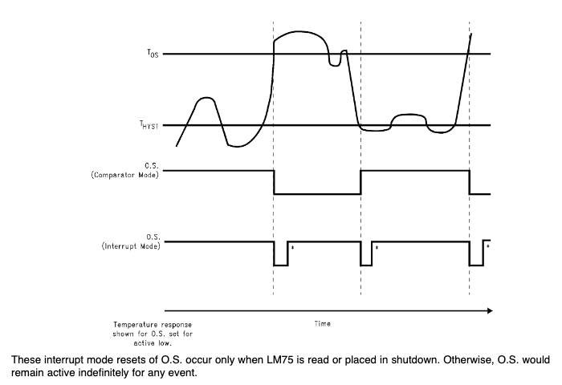

# LM75B

## MBED library for LM75B I2C temperature sensors

# Features

- Read temperature
- Set over temperature and hysteresis temperature
- Over temperature interrupt
- Full control over LM75B
- Multiple sensors on same I2C bus

# Usage
## Quick usage

#### Initialize LM75B:

``LM75B lm75(<I2C_SDA>, <I2C_SCL>, <address>);``

- **I2C_SDA**: pon on which the sda pin is connected. Must be on an I2C interface (e.g. `PB_9`)
- **I2C_SCL**: pon on which the scl pin is connected. Must be on an I2C interface (e.g. `PB_8`)
- **address**: last 3 bits of lm75b address (e.g. `0b00000001`)

 

#### Initialize LM75B with interrupt:

``LM75B lm75(<I2C_SDA>, <I2C_SCL>, <address>, <osPin>, <osISR>);``

- **I2C_SDA**: pon on which the sda pin is connected. Must be on an I2C interface (e.g. `PB_9`)
- **I2C_SCL**: pon on which the scl pin is connected. Must be on an I2C interface (e.g. `PB_8`)
- **address**: last 3 bits of lm75b address (e.g. `0b00000001`)
- **osPin**: pin on which the O.S. pin is connected (e.g. `PC_8`)
- **osISR**: address of isr that will be executed if temperature exceeds os-temperature and falls under
  hyst-temperature (e.g `&osISR`)

 

#### Set LM75B to default values:

`lm75.init();`

Sets sensor in comparator mode with an active low O.S. pin.\
Disables shutdown mode

 

#### Get temperature:

``lm75.getTemperature();``

Returns the temperature as `float`

 

#### Set os-temperature:

``lm75.setTemperatureOS(<temperature>);``

- **temperature** `float`: sets the os-temperature

 

#### Set hyst-temperature:

``lm75.setTemperatureHYST(<temperature>);``

- **temperature** `float`: sets the hyst-temperature

 

## Advanced usage

#### Set shutdown mode:

``lm75.setShutdownMode(<shutdown>);``

- **shutdown** `bool`:  `true` if sensor should be in shutdown mode

 

#### Set comparator/interrupt mode:

``lm75.setCmpIntMode(<cmpMode>);``

- **cmpMode** `bool`:  `true` if sensor should be in comparator mode

 

#### Set os polarity:

``lm75.setOSPolarity(<activeLow>);``

- **activeLow** `bool`:  `true` if O.S. pin should be in active low

 

#### Set os polarity:

``lm75.getFaultQueue();``

Returns the faults as `int`

 

#### Get os-temperature:

``lm75.getTemperatureOS();``

Returns the os-temperature as `float`

 

#### Get hyst-temperature:

``lm75.getTemperatureHYST();``

Returns the hyst-temperature as `float`

 

#### Enable O.S. IRQ:

`lm.enableIRQ();`

enables the O.S. pin interrupt

 

#### Disable O.S. IRQ:

`lm.disableIRQ();`

disables the O.S. pin interrupt

# Temperature response diagram

# Notes

- Tested on NUCLEO-L152RE (STM32)
- The temperature is measured and read in 0.5 °C steps
- The os/hyst-temperature can also be set in 0.5 °C steps
- OS-temperature is at power up at 80 °C
- HYST-temperature is at power up at 75 °C
- In shutdown mode all registers can be written and read
- Interrupt in this library uses comparator mode and calls ISR on falling and rising edges of O.S. pin
- When using interrupt mode on O.S. pin, you need to read from the sensor to reset the O.S. signal, otherwise it will
  remain in the current state forever (see LM75b datasheet)
